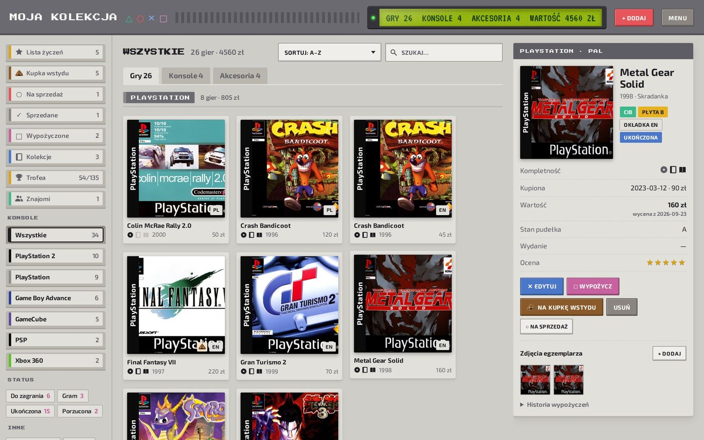
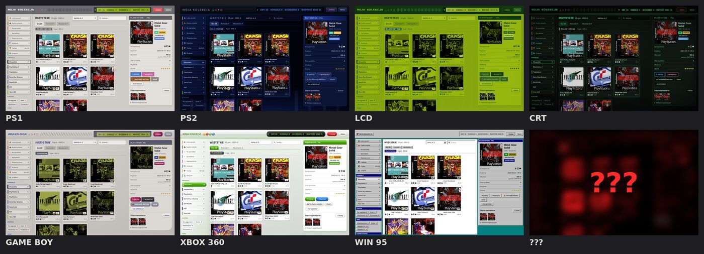
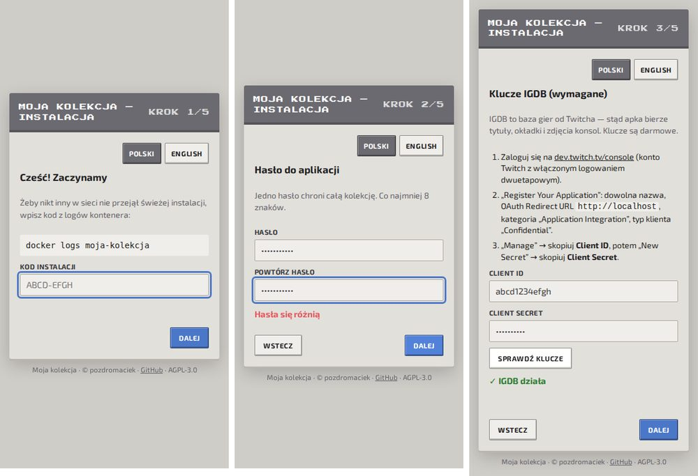

# Moja kolekcja — biblioteka fizycznych gier na własnym serwerze

**[English → README.md](README.md)**

Spis fizycznych gier, konsol i akcesoriów: co masz, ile to jest warte, co leży na kupce wstydu i komu pożyczyłeś GTA.
Działa w jednym kontenerze Dockera na Twoim serwerze (Raspberry Pi, stary terminal, NAS), a kolekcja zostaje u Ciebie.

> **Beta 1.0**. Wszystko opisane niżej działa, ale mogą się trafić niedoróbki. Błędy zgłaszaj w Issues.



## Co potrafi

**Dodawanie i katalog**
- Dodawanie gry po tytule albo po numerze seryjnym z pudełka (np. SLES-00250). Numer można zeskanować aparatem prosto
  w apce, z ustawieniem ostrości i przybliżeniem.
- Gry, konsole i akcesoria w jednym miejscu, ze zdjęciami i okładkami PAL.
- Okładki z paskiem konsoli i w proporcjach prawdziwego pudełka.
- Region, język okładki, numer seryjny i wydania specjalne (Steelbook, edycje kolekcjonerskie).
- Kompletność (pudełko, instrukcja, płyta), stan egzemplarza i zdjęcia własnej sztuki (bez lokalizacji z GPS).
- Oceny w gwiazdkach i statusy: do zagrania, gram, ukończona, porzucona.

**Wartość**
- Sugerowana cena na podstawie ofert z eBaya, przeliczona po kursie NBP.
- Wykres wartości kolekcji w czasie.
- Waluty: PLN, EUR, USD, GBP, CHF, CZK.
- Raport PDF z całą kolekcją, np. do ubezpieczenia.

**Kupowanie i sprzedaż**
- Lista życzeń z ceną docelową i szybkim szukaniem w wybranych sklepach: OLX, Allegro, eBay (.com/.de/.co.uk),
  Vinted, PriceCharting.
- Przycisk „Kupiłem” przenosi grę z listy życzeń do kolekcji.
- Filtr „Duble”.
- Sprzedaż z gotowym ogłoszeniem i paczką zdjęć, a potem archiwum sprzedanych z zyskiem albo stratą.

**Granie**
- Kupka wstydu (opcjonalna).
- „Co dziś zagrać?”: losuje grę z kupki jak jednoręki bandyta.
- Wypożyczenia z terminem zwrotu i historią; apka pokazuje, co jest po terminie.

**Kolekcjonowanie**
- Kolekcje serii: ile części Gran Turismo masz, a których brakuje.
- Exclusive'y, czyli gry wydane tylko na daną konsolę.
- Znajomi: wymiana „kodem kolekcji” i porównanie, bez żadnego serwera pośrodku.

**Statystyki i zabawa**
- Statystyki w trzech stylach: telewizor, ekran LCD albo instrukcja z pudełka.
- 135 trofeów jak na konsoli, łącznie z platyną.
- Podsumowanie „Twój rok w grach”.
- Ekranik LCD w nagłówku z animacją startu jak w konsoli.
- Siedem wyglądów: PS1, PS2, Game Boy, Xbox 360, Windows 95, LCD i kineskop. I parę sekretów.

**Od strony technicznej**
- Działa w przeglądarce na komputerze i telefonie, a na telefonie można ją dodać do ekranu głównego jak apkę.
- Wersja polska i angielska.
- HTTPS w domowej sieci na własnym certyfikacie. Lokalny urząd certyfikacji może podpisać tylko adresy domowe, więc nie
  da się nim podrobić żadnej strony w internecie.
- Codzienny backup, eksport do CSV/JSON i przywracanie z kopii.



## Instalacja

Potrzebny jest komputer z Dockerem (x86-64 albo ARM64).

### Docker Compose (polecane)

```bash
mkdir moja-kolekcja && cd moja-kolekcja
curl -O https://raw.githubusercontent.com/pozdromaciek/game-lib-sh/main/docker-compose.yml
docker compose up -d
docker logs moja-kolekcja        # tu jest kod instalacji
```

### Sam Docker

```bash
docker run -d --name moja-kolekcja --restart unless-stopped \
  -p 8080:8080 -p 8443:8443 -v kolekcja-data:/data \
  ghcr.io/pozdromaciek/game-lib-sh:latest
docker logs moja-kolekcja        # tu jest kod instalacji
```

### Pierwsze uruchomienie

Otwórz `http://<adres-serwera>:8080`. Kreator zapyta o:

1. **Kod instalacji** z `docker logs moja-kolekcja`. Dzięki temu instalację dokończy tylko ktoś, kto ma dostęp do
   serwera.
2. **Hasło** do aplikacji (min. 8 znaków, zapisywane tylko jako skrót scrypt).
3. **Klucze IGDB** (wymagane, darmowe). IGDB to baza gier Twitcha. Zaloguj się na
   [dev.twitch.tv/console](https://dev.twitch.tv/console) → *Register Your Application* (dowolna nazwa, redirect URL
   `http://localhost`, kategoria *Application Integration*, typ *Confidential*) → *Manage* → skopiuj *Client ID*
   i wygeneruj *Client Secret*.
4. **Klucze eBay** (opcjonalne, można pominąć) do sugerowanej ceny. Weźmiesz je z
   [developer.ebay.com](https://developer.ebay.com/) → *Application Keys* → zestaw **Production** (*App ID* i *Cert ID*).

Kreator sprawdza każdy klucz w prawdziwej usłudze, zanim go zapisze. Klucze (także opcjonalne klucze
[ScreenScrapera](https://www.screenscraper.fr/) do okładek z konkretnego regionu) i hasło zmienisz później
w **Menu → Narzędzia**.



### Konfiguracja przez `.env` (opcjonalnie)

Wszystko da się też ustawić zmiennymi środowiskowymi, patrz [`.env.example`](.env.example). Wartość z `.env` ma
pierwszeństwo i nie da się jej zmienić z poziomu apki. Starsze instalacje z `.env` działają dalej i pomijają kreator.

## Aktualizacja

```bash
docker compose pull && docker compose up -d
```

Dane są w wolumenie `kolekcja-data` (`/data`), a migracje bazy robią się same.

## HTTPS i aparat w telefonie

Przeglądarka pozwala użyć aparatu w oknie strony tylko przez HTTPS. Kontener wystawia HTTPS na porcie 8443
z certyfikatem od własnego, lokalnego CA. Zainstaluj ten certyfikat raz na telefonie (Menu → Narzędzia → Bezpieczne
połączenie, instrukcja krok po kroku dla Androida, iPhone'a i komputera) i otwieraj `https://<adres-serwera>:8443`.

## Kopie zapasowe

Co noc w `/data/backups` powstaje ZIP z bazą, okładkami i zdjęciami (domyślnie 14 kopii). W Menu → Narzędzia jest też
eksport CSV, backup JSON i przywracanie. Kopia na drugi dysk: podmontuj katalog do kontenera i ustaw `BACKUP_COPY_DIR`.

## Licencja

Copyright © 2026 [pozdromaciek](https://github.com/pozdromaciek).

Darmowa i otwarta, na licencji **GNU AGPL-3.0** ([LICENSE](LICENSE)) z **dodatkowymi warunkami** z sekcji 7
([NOTICE](NOTICE)):

- informacja o autorze (pozdromaciek + linki do profilu i tego repozytorium) musi zostać widoczna w oknie
  „O aplikacji” w każdej kopii i przeróbce, także udostępnianej przez sieć;
- przeróbka musi być oznaczona jako zmieniona i nie może udawać oryginału;
- nie wolno używać nicku autora do reklamowania przeróbek bez jego zgody.

W skrócie: możesz używać, udostępniać i zmieniać za darmo, ale credits zostają, a jeśli udostępniasz innym zmienioną
wersję, udostępniasz też jej kod na tej samej licencji.

## Wsparcie

Jeśli apka Ci się przydaje, możesz [postawić mi kawę ☕](https://buycoffee.to/pozdromaciek). Dzięki!

## Źródła danych

Dane o grach: [IGDB](https://www.igdb.com/) (Twitch). Okładki: ScreenScraper, LaunchBox Games Database,
libretro-thumbnails. Numery seryjne: Redump i No-Intro (libretro-database). Zdjęcia sprzętu: Wikimedia Commons
(m.in. Evan-Amos). Kursy walut: Narodowy Bank Polski. Czcionki (SIL OFL): Exo 2, Press Start 2P, VT323, Open Sans,
Nunito.

Nazwy konsol i gier należą do ich właścicieli. Wyglądy są inspirowane sprzętem z epoki i nie używają logo.
Projekt nie jest powiązany z Sony, Microsoftem, Nintendo, eBayem ani Twitchem.
